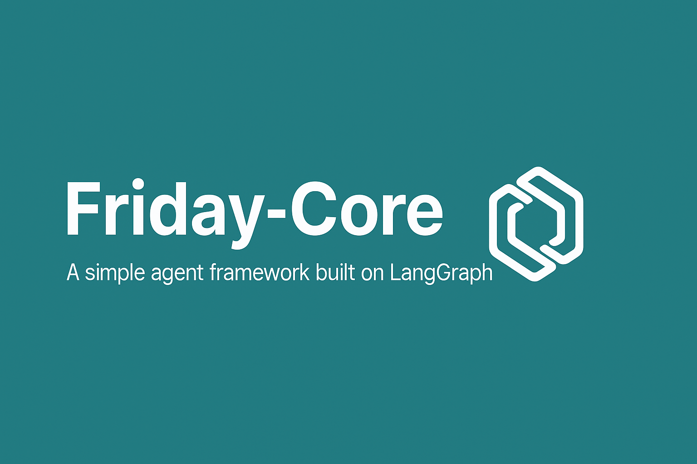

<p align="center">
  
</p>

<p align="left">
  <a href="https://github.com/theaiintegrators">
    
  </a>
  
  
  
  
  
</p>

# 📦 friday-core  

> **Modular orchestration engine for enterprise-grade multi-agent AI workflows**  
> This repository contains the **public / open-core edition**, with a minimal, LangGraph-based example workflow.

Friday Core provides the foundational building blocks for constructing **deterministic, evaluable, and observable multi-agent systems**, inspired by modern patterns such as:

- **Microsoft Agent Framework** (orchestrated agents & routing)  
- **LangGraph-style orchestration**  
- **OpenAI Model Context Protocol (MCP)**  
- **Agent-to-Agent (A2A) message passing**  
- **LangSmith / DeepEval-style evaluation workflows**  
- **LangFuse-style observability pipelines**  

The goal of this public edition is to provide a **clean, safe, and minimal starting point** that reflects how the Friday ecosystem thinks about agentic systems—without exposing enterprise-only internals.

---

## 🌟 Why friday-core Exists

Most “agent frameworks” today focus on flashy demos rather than production reliability.

Enterprise AI teams actually need:

- deterministic execution  
- strongly defined agent interfaces  
- reproducible workflows  
- structured evaluation gates  
- production-ready observability  
- modular components that can run on cloud or on-prem  
- graph-based routing, not ad-hoc function chains  

Friday Core aims to fill this gap by offering a **minimal, extensible orchestration engine** suitable for real systems.

This repo showcases the **open-core / public edition** with a simplified LangGraph workflow and a couple of demo agents.

---

## ✨ Features (Public Edition)

The public `friday-core` repository is intentionally minimal and focuses on:

- ✅ A simple **LangGraph-based** workflow  
- ✅ Sample agents:
  - `SearchAgent` – demo search behaviour  
  - `MathAgent` – tiny arithmetic agent  
- ✅ Deterministic, linear state flow  
- ✅ Zero secrets / no private infra dependencies  
- ✅ “Clone → install → run” in a few commands  
- ✅ A safe playground for experimenting with agent workflows

It **does not** include enterprise-only modules such as the full orchestrator, evaluation hooks, or observability pipelines. Those belong to Friday’s private / enterprise edition.

---

## 🏛 Architecture Overview (Public Edition)

The public example demonstrates a **very simple linear flow**:

```
User Input
    ↓
SearchAgent
    ↓
MathAgent
    ↓
Final Output (state)
```

Under the hood, this is implemented using a small **LangGraph `StateGraph`**:

- Nodes are Python functions  
- State is a typed dict  
- Each node updates part of the state and passes it forward  

This keeps the public edition:

- easy to reason about  
- easy to extend  
- safe to open-source  

### Enterprise Architecture (Conceptual Only)

In the full Friday ecosystem, Friday Core is designed around the following conceptual components (not all present in this repo):

- **Orchestrator** – drives the event loop & execution order  
- **Agent** – encapsulated behaviour with a minimal `run(...)` interface  
- **Event** – typed message object that flows between agents  
- **Router** – determines next agent via deterministic logic  
- **Evaluation Hooks** – optional validators inserted between steps  
- **Observability Hooks** – emit structured traces & metrics  

```
   ┌────────┐      ┌────────┐
   │ Agent A│◀────►│ Agent B│
   └───▲────┘      └───▲────┘
       │               │
       ▼               ▼
   ┌────────────────────────┐
   │      Orchestrator      │
   │  (Event Loop + Router) │
   └────────────────────────┘
```

These components are part of the **broader Friday architecture** and are **not fully exposed** in this open-core repo.

---

## 📚 Repository Structure

Current public repo layout:

```
friday-core/
  ├── friday/
  │   ├── agents/
  │   │   ├── math_agent.py
  │   │   └── search_agent.py
  │   │
  │   ├── graphs/
  │   │   └── sample_graph.py
  │   │
  │   └── utils/
  │       └── logger.py
  │
  ├── examples/
  │   └── run_demo.py
  │
  ├── requirements.txt
  ├── LICENSE
  └── README.md
```

---

## 🚀 Quick Start

### 1️⃣ Clone the repository

```bash
git clone https://github.com/theaiintegrators/friday-core.git
cd friday-core
```

### 2️⃣ (Optional) Create & activate a virtual environment

```bash
python -m venv venv
source venv/bin/activate        # macOS / Linux
# venv\Scripts\activate       # Windows
```

### 3️⃣ Install dependencies

```bash
pip install -r requirements.txt
```

### 4️⃣ Run the demo

```bash
python examples/run_demo.py
```

You should see something like:

```
===== Friday-Core Demo Start =====
{
  'input': 'Tokyo',
  'search_result': {...},
  'math_result': 'Invalid expression'
}
===== Demo Completed =====
```

Feel free to edit `user_input` inside `examples/run_demo.py` to explore different behaviours.

---

## 🔌 Extending the Public Edition

You can easily add your own agents and nodes:

- Create a new agent in `friday/agents/`  
- Wire it into the graph via `friday/graphs/sample_graph.py`  
- Update the state type and node logic  
- Re-run the demo and observe the state evolution  

This is a great way to prototype agent logic before moving into more advanced orchestration patterns.

---

## 🧪 Roadmap (High-Level)

Some of the capabilities that Friday Core (as a broader ecosystem) explores or targets:

- A2A routing patterns  
- MCP tool integration  
- Built-in evaluation templates  
- LangFuse-style trace enrichment  
- Workflow visualisation  
- YAML-defined pipelines  
- Friday CLI  

Not all of these will land in the public / open-core repo, but the design is influenced by these ideas.

---

## 🔭 Vision

Friday Core aims to make AI workflows:

- **predictable**  
- **testable**  
- **observable**  

— suitable for **real enterprise production systems**, not just prototypes.

The public edition you see here is a **safe entry point** into that philosophy.

---

## 📄 License

This project is licensed under the **MIT License**.  
You are free to use, modify, and distribute the public edition.

---

## 💬 Contact & Contributions

- 💡 **Questions / ideas / feedback?**  
  Please open an **Issue** or **Discussion** in this repository.
- 🛠 **Contributions** (especially around examples, docs, and public-safe utilities) are very welcome.  
  Feel free to submit a PR.

For ecosystem-level updates and related projects, visit:  
👉 https://github.com/theaiintegrators
